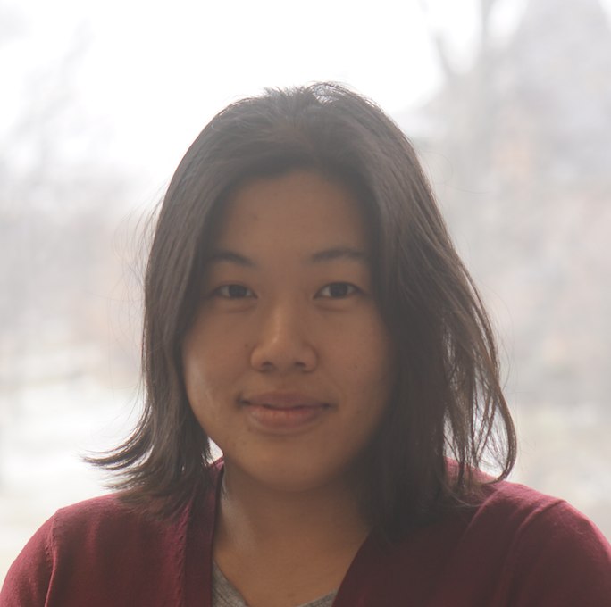

                

           
           <b>Hui Fen (Sarah) Tan</b> 
         
           <a class="paper" href="https://scholar.google.com/citations?user=_tSKmPYAAAAJ&hl=en">Google Scholar</a> 

           <a class="paper" href="https://www.linkedin.com/in/shftan/">LinkedIn</a> 

           <a class="paper" href="https://github.com/shftan">Github</a>
        

        
        

                
I am a research scientist at Facebook, working on safe and robust experimentation and causal inference. I am also interested in interpretability and algorithmic fairness. I received my PhD from <a href="https://stat.cornell.edu/">Cornell Statistics</a>, where I was advised by <a href="http://faculty.bscb.cornell.edu/~hooker/">Giles Hooker</a> and <a href="https://courses.cit.cornell.edu/mtw1/">Martin Wells</a>, with <a href="https://www.cs.cornell.edu/people/tj/">Thorsten Joachims</a> and <a href="https://www.microsoft.com/en-us/research/people/rcaruana/">Rich Caruana</a> on my committee. I recently co-founded the <a href="https://www.trustworthyml.org/">Trustworthy ML Initiative</a>.
 
                

Previously, I studied at Berkeley and Columbia, and worked in public policy in NYC, including the health department and public hospitals system. In 2014, I was a <a href="http://www.dssgfellowship.org/">Data Science for Social Good</a> fellow. I spent two summers at Microsoft Research, working with <a href="https://www.microsoft.com/en-us/research/people/rcaruana/">Rich Caruana</a>, <a href="https://www.microsoft.com/en-us/research/people/kori/">Kori Inkpen</a>, and <a href="https://www.microsoft.com/en-us/research/people/eckamar/">Ece Kamar</a>. During the later years of my PhD studies, I was based in the SF Bay Area where I was a visiting student and bioinformatics programmer at <a href="https://epibiostat.ucsf.edu/">UCSF</a>. I am on the board of the <a href="https://wimlworkshop.org">Women in Machine Learning</a> organization.
  
                
        

<h3>Contact</h3>

I'm currently based in the SF Bay Area. You can reach me at ht395 AT cornell DOT edu. 

<h3>News</h3>

- 10/19: I gave a talk at Data & Society's Meeting on Fair ML in Health about risk scoring models in healthcare.
- 7/19: I had a blast helping out with [UCSF's AI4ALL program](http://ai4all.ucsf.edu/)! I presented on dataset bias and helped mentor a project team using electronic medical records to predict opioid overdose and other conditions. 
- 4/19: I will be giving a talk at Columbia's Data Science Institute in the [Data for Good seminar series](https://events.columbia.edu/cal/event/eventView.do?href=/public/cals/MainCal/CAL-00bb9e24-69b3e39a-0169-b633b324-000010e3.ics).
- 3/19: I'm excited to help teach the new [ML for biomedicine course at UCSF](https://ticr.ucsf.edu/courses/machine_learning.html). This is perhaps the first official ML course at UCSF and I'm looking forward to teaching again!
- 12/18: I'm co-organizing a workshop at ICLR 2019 on [Debugging ML models](https://debug-ml-iclr2019.github.io/). Submit your paper or demo!
- 6/18: Honored to receive a [Microsoft Research Dissertation Grant](https://www.microsoft.com/en-us/research/academic-program/dissertation-grant/#!grant-recipients)
- 6/17: Grateful to receive the [American Statistical Association Wray Jackson Smith Award](http://stattrak.amstat.org/2017/07/01/smithscholarship/)
- 3/17: My project evaluating the impact of later school start times in NYC public schools has received an [Engaged Cornell grant](http://engaged.cornell.edu/recipient/2017-18-engaged-graduate-student-grant-recipients/). You can read more about it [here](https://cals.cornell.edu/news/engaged-graduate-student-grants-fund-phd-students/) and [here](http://news.cornell.edu/stories/2017/04/engaged-graduate-student-grants-fund-16-phd-students)

For older news, click <a class="paper" href="oldernews.html">here</a>.

<h3>Code & Data</h3>

- R package [surfin: (Statistical Inference for Random Forests)](http://shftan.github.io/surfin/)
- [Data and code](https://github.com/shftan/auditblackbox) for distilling black-box risk scores paper

<h3>Publications and Preprints</h3>
<h4>Preprints</h4>

- <a class="paper" href="papers/globaladditive.pdf">Learning Global Additive Explanations for Neural Nets Using Model Distillation</a>
   - Tan, R Caruana, G Hooker, P Koch, A Gordo
   - Under review 
   - Preliminary version in _NeurIPS 2018 Machine Learning for Health Workshop_
- <a class="paper" href="papers/turkercompas.pdf">Investigating Human + Machine Complementarity: A Case Study on Recidivism</a>
   - Tan, J Adebayo, K Inkpen, E Kamar
   - Under review
   - Preliminary version in _NeurIPS 2018 Workshop on Ethical, Social and Governance Issues in AI_ (Spotlight)
- Proximity Score Matching: Locally Adaptive Matching for Causal Inference
   - Tan, D Miller, J Savage
   - Full version in progress. Preliminary version in _NIPS 2015 Machine Learning in Healthcare Workshop_
   - Lightning talk, _Atlantic Causal Inference Conference 2015_
   - 1 of 3 Best Student Paper Awards from American Statistical Association's SSPA section
- <a class="paper" href="https://arxiv.org/abs/2006.06466">How Interpretable and Trustworthy are GAMs?</a>
   - CH Chang, Tan, B Lengerich, A Goldenberg, R Caruana
   - Under review
<h4>Journal and Conference Papers</h4>
- <a class="paper" href="https://arxiv.org/abs/1611.07115">Tree Space Prototypes: Another Look at Making Tree Ensembles Interpretable</a>
   - Tan, M Soloviev, G Hooker, M Wells
   - _ACM-IMS FODS 2020_ 
   - Also appeared in: _NIPS 2016 Interpretability Workshop_
- <a class="paper" href="https://arxiv.org/abs/1911.04974">Purifying Interaction Effects with the Functional ANOVA: An Efficient Algorithm for Recovering Identifiable Additive Models</a>
   - B Lengerich, Tan, CH Chang, G Hooker, R Caruana
   - _AISTATS 2020_
- <a class="paper" href="https://arxiv.org/abs/2002.01111">Do I Look Like a Criminal? Examining the Impact of Racial Information on Human Judgement</a>
   - K Mallari, K Inkpen, P Johns, Tan, D Ramesh, E Kamar
   - _CHI 2020_
- <a class="paper" href="https://arxiv.org/abs/1810.09092">Axiomatic Interpretability for Multiclass Additive Models</a>
   - X Zhang, Tan, P Koch, Y Lou, U Chajewska, R Caruana
   - _KDD 2019_ (Oral)
   - [Video](https://drive.google.com/file/d/14ECmVDOfW0kOBra68ZSHoeSq8nGdePF5/view?usp=sharing)
- <a class="paper" href="https://arxiv.org/abs/1710.06169">Distill-and-Compare: Auditing Black-Box Models Using Transparent Model Distillation</a>
   - Tan, R Caruana, G Hooker, Y Lou
   - _AIES 2018_ (Oral)
   - Also appeared in: _NIPS 2017 Interpretability Symposium_ (Spotlight), _NIPS 2017 Transparent Machine Learning in Safety Critical Environments Workshop_ (Spotlight)
   - Media coverage: [MIT Technology Review](https://www.technologyreview.com/s/609338/new-research-aims-to-solve-the-problem-of-ai-bias-in-black-box-algorithms/), [Politico](https://www.politico.com/agenda/story/2018/02/07/algorithmic-bias-software-recommendations-000631), [Futurism](https://futurism.com/ai-bias-black-box/), [WorkFlow](https://www.servicenow.com/workflow/algorithmic-audit.html) 
   - <a class="resource" href="https://github.com/shftan/auditblackbox">Code and data</a>
- <a class="paper" href="https://www.sciencedirect.com/science/article/pii/S1755436516300755">A Bayesian Evidence Synthesis Approach to Estimate Disease Prevalence in Hard-To-Reach Populations: Hepatitis C in New York City</a>
   - Tan, S Makela, D Heller, K Konty, S Balter, T Zheng, J Stark
   - _Epidemics_ 2018
   - Presented to NYC Health Commissioner. Talk at [NDRI](http://www.ndri.org) 
   - <a class="resource" href="https://www.sciencedirect.com/science/article/pii/S1755436516300755?via%3Dihub#sec0190">Code</a>
- <a class="paper" href="http://journals.sagepub.com/doi/abs/10.1177/0003122415598534">"No Fracking Way!" Documentary Film, Discursive Opportunity, and Local Opposition against Hydraulic Fracturing in the United States, 2010 to 2013</a>
   - I Vasi, E Walker, JS Johnson, Tan 
   - _American Sociological Review_ 2015
   - 2 Best Paper Awards from American Sociological Association's [CITAMS](https://citams.org/citasa-awards) and [CBSM](http://cbsm-asa.org/awards) sections 
   - Media coverage: [The Guardian](https://www.theguardian.com/environment/2015/sep/02/gasland-hbo-documentary-fracking-opposition), [The Atlantic](https://www.theatlantic.com/entertainment/archive/2017/02/a-common-theme-for-this-years-oscar-nominated-documentaries/517638/), [Pacific Standard](https://psmag.com/environment/a-fracking-effective-film)
   - Press releases: [University of Iowa](http://www.newswise.com/articles/the-power-of-film), [Harmony Institute](https://harmonylabs.org/gasland)
   
<h4>Posters and Workshop Papers</h4>
- <a class="paper" href="https://arxiv.org/abs/1904.12991">"Why Should You Trust My Explanation?" Understanding Uncertainty in LIME Explanations</a>
   - Y Zhang, K Song, Y Sun, Tan, M Udell
   - _ICML 2019 AI for Social Good Workshop_ 
- Teaching biomedical applications of computer vision using docker containers
   - DS Lituiev, Tan, A Bishara, J H Sohn, J Kornak, D Hadley
   - _UC Conference on AI in Biomedicine 2019_ 
- <a class="paper" href="https://arxiv.org/abs/1711.07104">A Double Parametric Bootstrap Test for Topic Models</a>
   - S Seto, Tan, G Hooker, M Wells 
   - _NIPS 2017 Interpretability Symposium_
- <a class="paper" href="http://www.homepages.ucl.ac.uk/~ucgtrbd/whatif/Paper23.pdf">Probabilistic Matching: Incorporating Uncertainty to Improve Propensity Score Matching</a>
   - Tan, G Hooker, M Wells 
   - _NIPS 2016 Causal Inference Workshop_
   
For older publications and posters, click <a class="paper" href="olderpublications.html">here</a>.

<h3>Service</h3>

- Co-organizer (together with Himabindu Lakkaraju, Sara Hooker, Subhabrata Majumdar, Chhavi Yadav, Jaydeep Borkar), [Trustworthy ML Initiative](https://www.trustworthyml.org/)
- Co-organizer (together with Himabindu Lakkaraju, Julius Adebayo, Jacob Steinhardt, D. Sculley, Rich Caruana), ICLR 2019 Workshop [“Debugging Machine Learning Models”](https://iclr.cc/Conferences/2019/Schedule?showEvent=628)
- Program committee:
  - Conferences: NeurIPS, ICML, ICLR, AAAI, [Conference on Health, Inference, and Learning (CHIL)](https://www.chilconference.org/)
  - Journals: JAIR, TPAMI, TIST, Journal of Biomedical and Health Informatics
  - Workshops: [Fair ML for Health](https://www.fairmlforhealth.com/), [Human-Centric Machine Learning](https://sites.google.com/view/hcml-2019), [Machine Learning for Health](https://ml4health.github.io/2019/), [Human In the Loop Learning](https://sites.google.com/view/hill2019/home), [Safe ML](https://sites.google.com/view/safeml-iclr2019/home), [Computer Vision for Agriculture](https://www.cv4gc.org/cv4a2020/), [Algorithmic Fairness through the Lens of Causality and Interpretability](https://www.afciworkshop.org/)
- Board member, [Women in Machine Learning](https://wimlworkshop.org) organization (WiML)
- Reviewer and interviewer, <a href="http://www.dssgfellowship.org/">Data Science for Social Good</a>
- Mentor, 2019 [UCSF's AI4ALL program](http://ai4all.ucsf.edu/)
- Mentor, [2018](https://wimlworkshop.org/2018/program/) and [2019](https://wimlworkshop.org/2019/program/) WiML Workshop mentoring roundtables
- Co-organizer (together with Michael Elliott and James O'Malley),  Invited Session ["New Advances in Causal Inference for Longitudinal and Survival Data"](http://ww2.amstat.org/meetings/ichps/2018/onlineprogram/Program.cfm) at International Conference on Health Policy Statistics (ICHPS) 2018
- Student representative, [ICHPS 2018](http://ww2.amstat.org/meetings/ichps/2018/) Scientific Committee
- Co-organizer (together with Rayid Ghani and Hadley Wickham), Topic-Contributed Session ["Statistics for Social Good"](http://shftan.github.io/jsmsocialgood/) at JSM 2016
- Co-organizer (together with Diana Cai, Deborah Hanus, Isabel Valera, Rose Yu), [2016 WiML Workshop](https://wimlworkshop.org/2016/). WiML Workshop has grown tremendously, and the year I organized, it had 600 attendees and 200 posters. I am most proud of the mentoring roundtables format we expanded that year, with [50 roundtables on research and career topics](https://wimlworkshop.org/2016/program/#1480549898816-ca283fe3-29b6) bringing together our attendees and experts in close conversation   
- **Cornell internal**: I was president of the [Statistics Graduate Society](https://stat.cornell.edu/about-us/sgs) and co-organized (together with Ashudeep Singh) the [Cornell Machine Learning reading group](http://wiki.cs.cornell.edu/index.php?title=Machine_Learning_Discussion_Group)

<h3>Miscellaneous</h3>

- I played piano and (bad) ukulele in an Indian fusion carnatic band. We have some videos [here](https://www.youtube.com/playlist?list=PLXf9tYVf-PxM6ESEflnJ8_Oow-j66CgYt)

